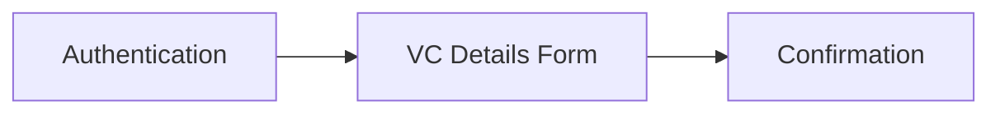
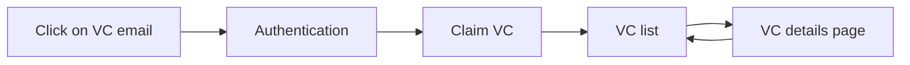
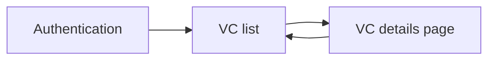
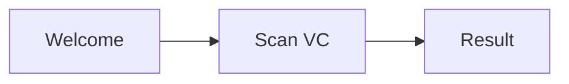

# Repository Archived and Moved

This repository has been archived and moved to a new location. This means that the repository is no longer actively maintained or updated. Please note the new location of the repository and update your references accordingly.

## New Repository Location

The repository has been moved to https://github.com/affinidi/reference-app-certification-and-verification

## Archived Repository

This repository will remain available in its current location for historical purposes. You may continue to use or reference the code, but please be aware that it is no longer being actively maintained or updated.

## Issues and Pull Requests

We will not be accepting any new issues or pull requests for this repository. If you encounter any issues with the code, please refer to the archived repository or the new repository location for potential solutions.

---

## Affinidi Elements Reference App

Frontend template for [@affinidi/cli](https://www.npmjs.com/package/@affinidi/cli)  
See the deployed [demo](https://holder-reference-app.stg.affinidi.com/)

&nbsp;

#

[Introduction](#introduction)  
[Features](#features)  
[Installation](#installation)  
[How to run](#how-to-run)  
[How to use](#how-to-use)  
[About the Certification and Verification use case](#about-the-certification-and-verification-use-case)  
[Feedback & Support](#feedback--support)  
[FAQ](#faq)

#

&nbsp;

&nbsp;

## Introduction

Affinidi’s vision is to empower communities with control and ownership of their data,
creating new business models and greater trust.

As the customer demand for control and ownership of data continues to grow, it is
becoming increasingly important for developers to better manage data privacy and portability
within their apps. With our tooling, you can start creating a privacy-preserving app within minutes.

### What are privacy-preserving apps?

Privacy-preserving apps make it easy to give your customers more control over how their information is used and shared. We enable this data ownership and control through Decentralized Identifiers (DIDs) and Verifiable Credentials (VCs).

Learn more about [VCs](https://academy.affinidi.com/what-are-verifiable-credentials-79f1846a7b9), [trust triangle](https://academy.affinidi.com/what-is-the-trust-triangle-9a9caf36b321), [Decentralized Identifiers (DIDs)](https://academy.affinidi.com/demystifying-decentralized-identifiers-dids-2dc6fc3148fd), and [selective disclosure](https://academy.affinidi.com/a-detailed-guide-on-selective-disclosure-87b89cea1602).
&nbsp;

&nbsp;

## Features

The Affinidi Reference App is a ready-to-use application that provides a web interface for:

- issuing VCs
- claiming and managing VCs
- verifying VCs

&nbsp;

&nbsp;

#

## Installation

This repository is supposed to be used as a template for [@affinidi/cli](https://www.npmjs.com/package/@affinidi/cli). Please see this [CLI Quick Start guide](https://github.com/affinidi/affinidi-cli#quick-start) to generate a fully working application with a populated `.env` file. Alternatively, you can generate a fully working application from [Affinidi VS Code Extension](https://github.com/affinidi/vscode-extension), which uses the CLI under the hood.

You may also clone this repository and run it separately, but in this case you need to fill in the `.env` file yourself. Follow the first two steps in the [CLI Quick Start guide](https://github.com/affinidi/affinidi-cli#quick-start) to get credentials from a project, and replace the placeholders in the `.env` file as follows:

- `<YOUR_AFFINIDI_APIKEY_HASH>` - `apiKey.apiKeyHash`
- `<YOUR_AFFINIDI_ISSUER_DID>` - `wallet.did`
- `<YOUR_AFFINIDI_PROJECT_ID>` - `project.projectId`

&nbsp;

&nbsp;

## How to run

From the directory where the application was generated, type in your terminal:

```
npm start
```

&nbsp;

&nbsp;

#

## How to use

The Affinidi Reference App is three applications in one. It provides three independent user flows for issuing, claiming/holding VCs, and verifying VCs, all housed in the same code base, to facilitate developer experience. In a real-world scenario, the three flows would never coincide in the same application but as a developer, you may need to build simultaneously for the three corners of the [_trust triangle_](https://academy.affinidi.com/what-is-the-trust-triangle-9a9caf36b321): issuer, holder and verifier.

The Reference App is tailored for the [Certification and Verification](#about-the-certification-and-verification-use-case) use case, but the Holder and Verifier flows can be easily extended to other use cases.

&nbsp;

### Home

This is the first screen you will see after the application starts. Here you can choose between the three user flows: Issuer, Holder and Verifier.

&nbsp;

### Issuer Flow



1. Authentication:  
   Here you are logging in as an _Issuer_. Please use your CLI credentials to log in (see the first step in the [CLI Quick Start guide](https://github.com/affinidi/affinidi-cli#quick-start)). This is a two-step process. You will need the confirmation code sent to your email.

2. VC Details Form:  
   The VC you can issue from the Reference App is based on the [Event Entry Eligibility Schema](https://schema.affinidi.com/EventElegibilityV1-0.json). Here you need to fill in the form with the event information and the future VC holder's details.

3. Confirmation:  
   In this screen, you receive the confirmation that the VC was issued or the message of an eventual error. Using the `ISSUE NEXT CREDENTIAL` button, you can start the issuance process again.

&nbsp;

### Holder Flow

This flow presupposes that at least one VC has been issued to a holder.

There are two variations of this flow:  
**Claim a VC**


1. Email:  
   As the holder of the VC, you click on the link in the email that was sent with the issuing of the VC. You are redirected to the app.

2. Authentication:  
   Here you are logging in as a _Holder_ with the same email address where the VC was received. This is a two-step process. You will need the confirmation code sent to your email.

3. Claim VC:  
   The application processes the VC and if successful redirects to the _VC List_ page. Any eventual errors are shown here.

4. VC List page:  
   Here you can see all claimed VCs. You can click on a VC card to see its details and display the QR code for verification.

5. VC details page:  
   Here you can see the full details of the VC and display its QR code for verification.

&nbsp;
**Manage VCs**


1. Authentication:  
   Here you are logging in as a _Holder_ with the same email address where the VC was received. This is a two-step process. You will need the confirmation code sent to your email.
   &nbsp;

2. VC List page:  
   Here you can see all claimed VCs. You can click on a VC card to see its details.

3. VC details page:  
   Here you can see the full details of the VC and display its QR code for verification.

&nbsp;

### Verifier Flow

This flow presupposes that at least one VC has been issued to a holder.



1. Welcome:  
   Here you are using the app as a verifier. Click on the `SCAN QR CODE` button to start the process.

2. Scan:  
   If prompted, accept the use of the camera by the application. Present the QR code of the VC to be verified to the camera. You may need to hold the QR code for a few seconds. Any eventual errors will be shown on this screen.

3. Result:  
    If the scanning was successful, two outcomes are possible:
   - valid credential
   - invalid credential

You can click on the `SCAN NEXT QR CODE` button to start the process again.

&nbsp;

&nbsp;

#

## About the Certification and Verification use case

The [Event Entry Eligibility Schema](https://schema.affinidi.com/EventElegibilityV1-0.json), which is the basis for the VC you can issue with the Reference App, is an example of the Certification and Verification use case. It is tailored to cover the issuance, the claiming and the verification of tickets for an event.

The three corners of the [trust triangle](https://academy.affinidi.com/what-is-the-trust-triangle-9a9caf36b321) in this case are:

- Issuer = event organizer or ticketing service
- Holder = event attendee
- Verifier = entry staff at event venue

The basic sequence of the flow is:

1. the event organizer [issues](#issuer-flow) the ticket
2. the event attendee [claims](#holder-flow) the ticket
3. the event entry staff [verifies](#verifier-flow) the ticket

&nbsp;

&nbsp;

#

## Feedback & Support

Click [here](https://github.com/affinidi/elements-reference-app-frontend/issues) to create a ticket and we will get on it right away. If you are facing technical or other issues, you can reach out to us on [Discord](https://discord.com/invite/jx2hGBk5xE).

&nbsp;

&nbsp;

## FAQ

### A note from Affinidi

Affinidi Developer Tools are currently in the open beta phase and we are refining our product every day. The Affinidi Developer Tools may be incomplete and may contain errors – they may be unstable and may cause a loss of functionality and data. Use of the Affinidi Developer Tools will be at your own risk. As our engineers seek to improve our platform, we would not have the resources to provide any maintenance or tech support at this time. Please bear with us as we continue to improve the platform.

### What can I develop?

You are only limited by your imagination! Affinidi Developer Tools is a toolbox with which you can build software applications for personal or commercial use.

### Is there anything I should not develop?

We only provide the tools - how you use them is largely up to you. We have no control over what you develop with our tools - but please use our tools responsibly!

We hope that you would not develop anything that contravenes any applicable laws or regulations. Your projects should also not infringe on Affinidi’s or any third party’s intellectual property (for instance, misusing other parties’ data, code, logos, etc).

### What responsibilities do I have to my end-users?

Please ensure that you have in place your own terms and conditions, privacy policies, and other safeguards to ensure that the projects you build are secure for your end users.

If you are processing personal data, please protect the privacy and other legal rights of your end-users and store their personal or sensitive information securely.

Some of our components would also require you to incorporate our end-user notices into your terms and conditions.

### Are Affinidi Developer Tools free for use?

Affinidi Developer Tools are free during the open beta phase, so come onboard and experiment with our tools and see what you can build! We may bill for certain components in the future, but we will inform you beforehand.

### Is there any limit or cap to my usage of the Affinidi Developer Tools?

We may from time to time impose limits on your use of the Affinidi Developer Tools, such as limiting the number of API requests that you may make in a given duration. This is to ensure the smooth operation of the Affinidi Developer Tools so that you and all our other users can have a pleasant experience as we continue to scale and improve the Affinidi Developer Tools.

### Do I need to provide you with anything?

From time to time, we may request certain information from you to ensure that you are complying with the [Terms of Use](https://build.affinidi.com/dev-tools/terms-of-use.pdf).

### Can I share my developer’s account with others?

When you create a developer’s account with us, we will issue you your private login credentials. Please do not share this with anyone else, as you would be responsible for activities that happen under your account. If you have friends who are interested, ask them to sign up – let's build together!

### Telemetry

Affinidi collects usage data to improve our products and services. For information on what data we collect and how we use your data, please refer to our [Privacy Policy](https://build.affinidi.com/dev-tools/privacy-policy.pdf).

Disclaimer:
Please note that this FAQ is provided for informational purposes only and is not to be considered a legal document. For the legal terms and conditions governing your use of the Affinidi Developer Tools, please refer to our [Terms of Use](https://build.affinidi.com/dev-tools/terms-of-use.pdf).
